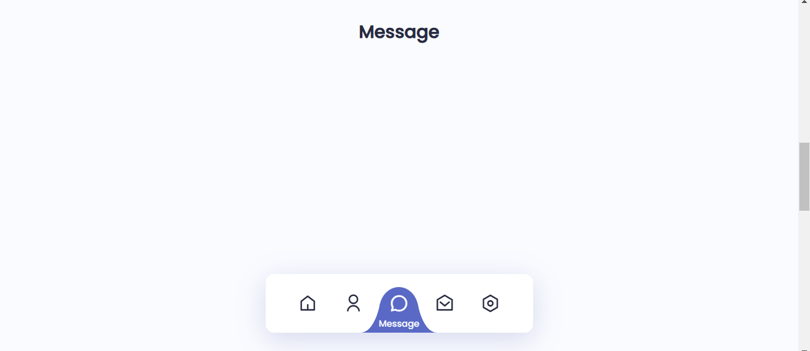
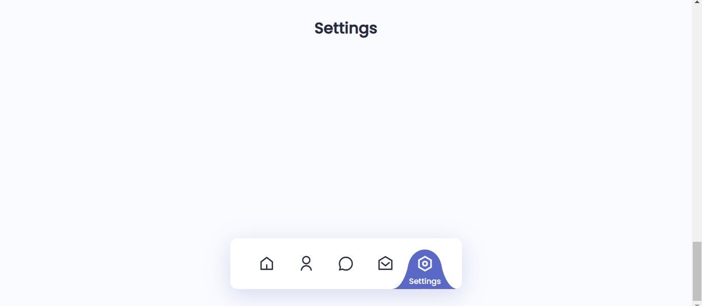

# MENU DE NAVEGACAO LIQUIDA
👨‍🏫INTERFACE DE "INDICADOR DE MENU DE NAVEGACAO LIQUIDA" COM HTML/CSS/SCSS/JS.

  

CLIQUE AQUI PARA VER MAIS FOTOS!

     
     
     
     
     

## DESCRIÇÃO
- Indicador de Menu de Navegação Líquido Utilizando HTML, CSS e JavaScript.
- Rolagem suave em cada seção.
- Desenvolvido primeiramente com a metodologia Mobile First e depois para desktop.
- Compatível com todos os dispositivos móveis e com uma interface de usuário bonita e agradável.

## COMO USAR?
   - Para usá-lo, basta apenas executar o arquivo: `./CODIGO/index.html` no navegador da sua preferência. 

## NÃO SABE?
- Entendemos que para manipular arquivos em `HTML`, `CSS` e outras linguagens relacionadas, é necessário possuir conhecimento nessas áreas. Para auxiliar nesse aprendizado, oferecemos cursos gratuitos disponíveis:
* [CURSO DE HTML E CSS](https://github.com/VILHALVA/CURSO-DE-HTML-E-CSS)
* [CURSO DE SCSS](https://github.com/VILHALVA/CURSO-DE-SCSS)
* [CURSO DE JAVASCRIPT](https://github.com/VILHALVA/CURSO-DE-JAVASCRIPT)
* [CONFIRA MAIS CURSOS](https://github.com/VILHALVA?tab=repositories&q=+topic:CURSO)

## CREDITOS:
- [PROJETO CRIADO PELO "bedimcode"](https://github.com/bedimcode/liquid-navigation-indicator/tree/main)
- [VEJA O VIDEO DESSE PROJETO](https://youtu.be/ArTVfdHOB-M?si=yTAK1WVcTcqZmtnN)
- [PROJETO EDITADO PELO VILHALVA](https://github.com/VILHALVA)
